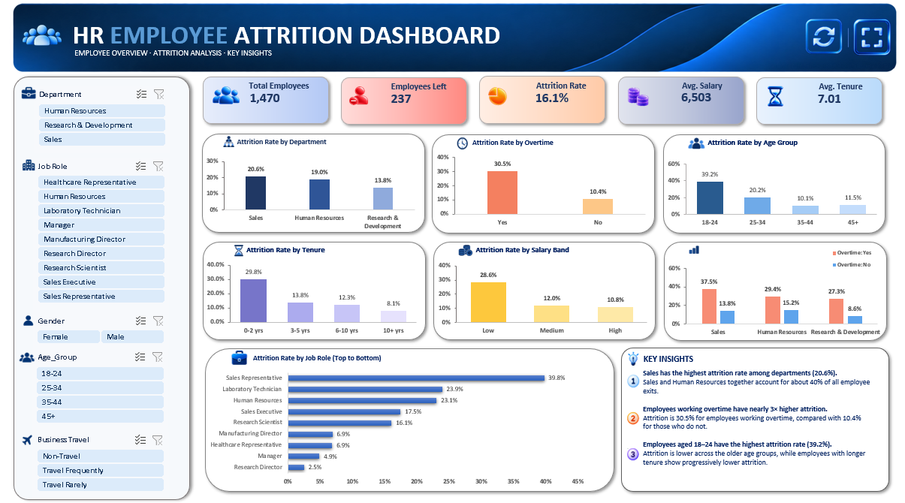
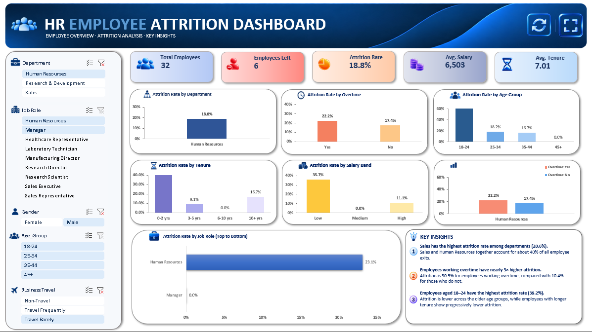
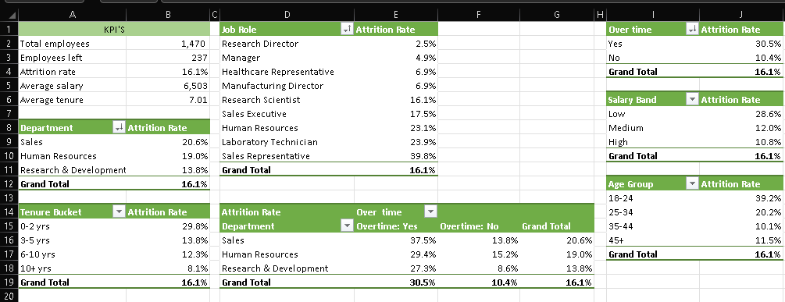
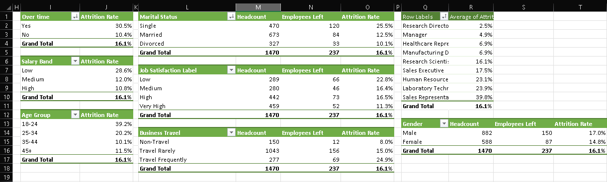
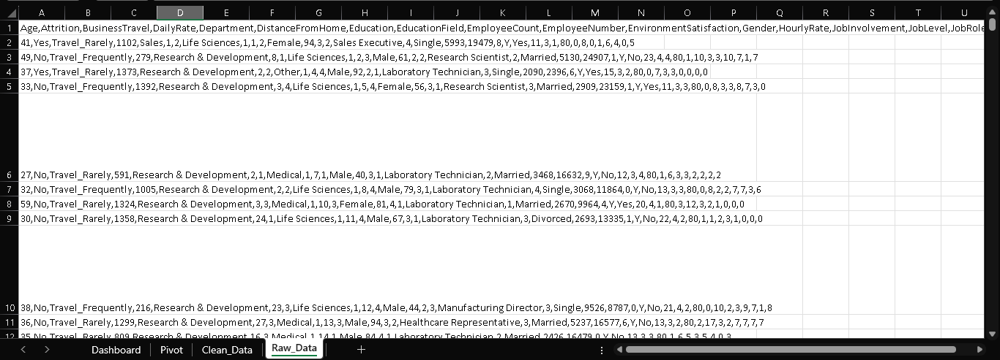
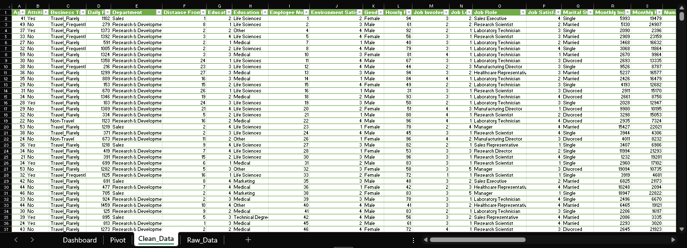
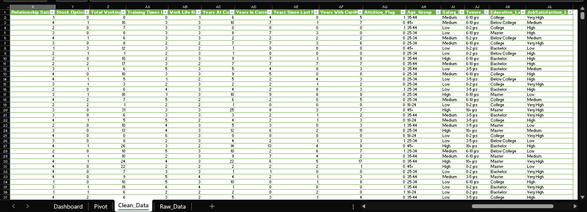

# IBM HR Analytics — Employee Attrition Dashboard

An interactive HR Analytics dashboard built in Microsoft Excel using the IBM HR Analytics Employee Attrition & Performance dataset from Kaggle.

This is my second data analytics project. I worked on the complete process from data cleaning and preparation to analysis, visualization, and dashboard development.

The dashboard uses PivotTables, PivotCharts, and interactive slicers. The KPIs and charts update dynamically whenever the slicer selections are changed.

---

## Dashboard Preview

### Filtered Dashboard

The dashboard dynamically changes based on the selected slicers, allowing different aspects of the employee data to be explored interactively.

---

## Project Overview

The main objective of this project was to transform raw employee data into an interactive dashboard that makes HR-related information easier to analyze.

The workflow followed in this project was:

Raw Data → Data Cleaning → PivotTable Analysis → Charts → Slicers → Interactive Dashboard

---

## Data Preparation

The original Kaggle dataset was reviewed and prepared before performing the analysis.

The workbook contains four main sheets:

- Raw_data — Original dataset
- Clean_data — Cleaned and prepared dataset
- Pivot — PivotTable analysis
- Dashboard — Final interactive dashboard

The cleaned dataset was then used to create the PivotTables and dashboard visualizations.

---

## Analysis

The dashboard provides analysis across different HR-related areas, including:

- Employee attrition
- Employee demographics
- Departments
- Job roles
- Employee income
- Employee satisfaction
- Workforce information

PivotTables were used to summarize the data and provide the foundation for the dashboard charts and KPIs.

---

## Dashboard

The dashboard includes:

- KPI cards
- Interactive charts
- PivotCharts
- Slicers
- Dynamic filtering
- Refresh functionality
- Full-screen dashboard control
- Last refreshed timestamp

The dashboard is designed so that selecting different slicer values automatically updates the connected KPIs and charts.

---

## PivotTable Analysis

The PivotTables were created to support the calculations and visualizations used in the dashboard.

---

## Data Cleaning

The raw dataset was reviewed and prepared before being used for analysis.

### Raw Data

### Cleaned Data

---

## Workbook Structure

The Excel workbook contains four main sheets:

| Sheet | Description |
|---|---|
| Raw_data | Original dataset |
| Clean_data | Cleaned and prepared dataset |
| Pivot | PivotTables used for analysis |
| Dashboard | Final interactive dashboard |

---

## Tools and Skills

- Microsoft Excel
- Data Cleaning
- Data Preparation
- PivotTables
- PivotCharts
- Slicers
- Excel Formulas
- Data Visualization
- Dashboard Design
- VBA
- Interactive Dashboard Development

---

## Dataset

The project uses the IBM HR Analytics Employee Attrition & Performance dataset from Kaggle.

Dataset source:

https://www.kaggle.com/datasets/pavansubhasht/ibm-hr-analytics-attrition-dataset

The dataset was used as the starting point for the analysis. The data preparation, PivotTable analysis, dashboard design, visualizations, and Excel automation were completed as part of this project.

---

## Project Structure

ibm-hr-analytics-excel-dashboard/
│
├── README.md
│
├── Assets/
│   ├── attendance_rate.png
│   ├── avg_salary.png
│   ├── avg_tenure.png
│   ├── banner.png
│   ├── chart_icon_set.png
│   ├── employees_left.png
│   ├── full_screen_button.png
│   ├── insights_icon_set.png
│   ├── refresh_button_icon.png
│   ├── slicers_icon_set.png
│   └── total_employees_icon.png
│
├── Excel/
│   └── IBM_HR_Analytics_Dashboard.xlsm
│
└── Screenshots/
    ├── clean_data_1.png
    ├── clean_data_2.png
    ├── dashboard.png
    ├── dashboard_filtered.png
    ├── delete.png
    ├── pivot_analysis_1.png
    ├── pivot_analysis_2.png
    └── raw_data.png

---

## How to Use

1. Download IBM_HR_Analytics_Dashboard.xlsm from the Excel folder.
2. Open the workbook using the desktop version of Microsoft Excel.
3. Enable macros/content if prompted by Excel.
4. Open the Dashboard sheet.
5. Use the available slicers to filter the dashboard.
6. The KPIs and charts will update based on the selected filters.
7. Use the dashboard controls when required.

The workbook contains VBA functionality, so it is recommended to use the desktop version of Microsoft Excel with macros enabled.

---

## What I Learned

This project helped me understand how different Excel features can be combined to build an interactive analytics dashboard.

I worked with the complete process of preparing data, creating PivotTables, building charts, adding slicers, and connecting everything into a dynamic dashboard.

It also gave me practical experience with data cleaning, analysis, visualization, dashboard design, and basic Excel VBA automation.

---

## Author

Suraj Pandey

Data Analytics | Excel | SQL | Python

LinkedIn:
https://www.linkedin.com/in/surajpandeytech

---

## Project Status

Completed — Project 2

This project is part of my data analytics portfolio.